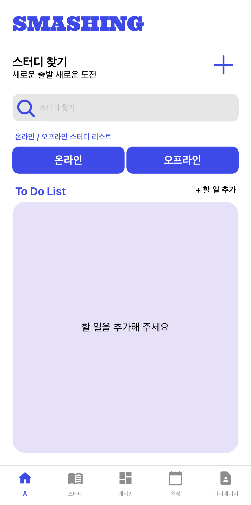
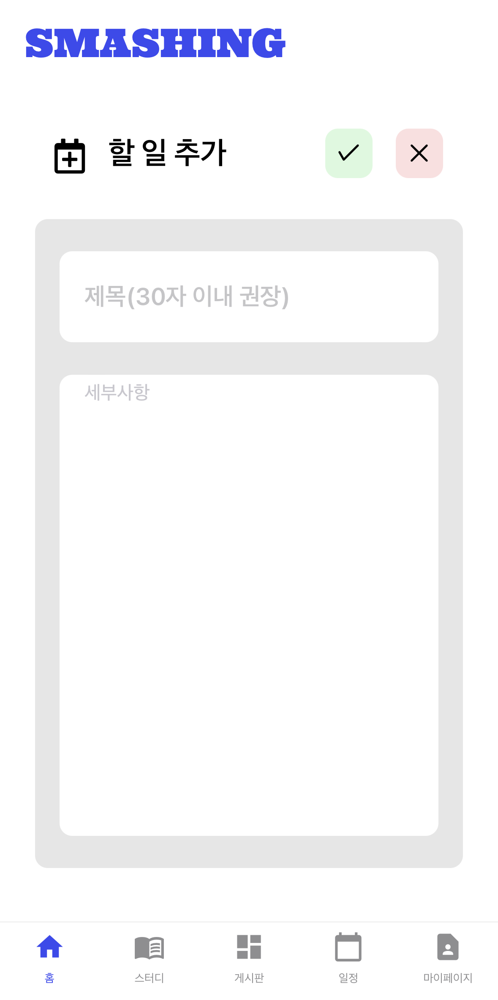
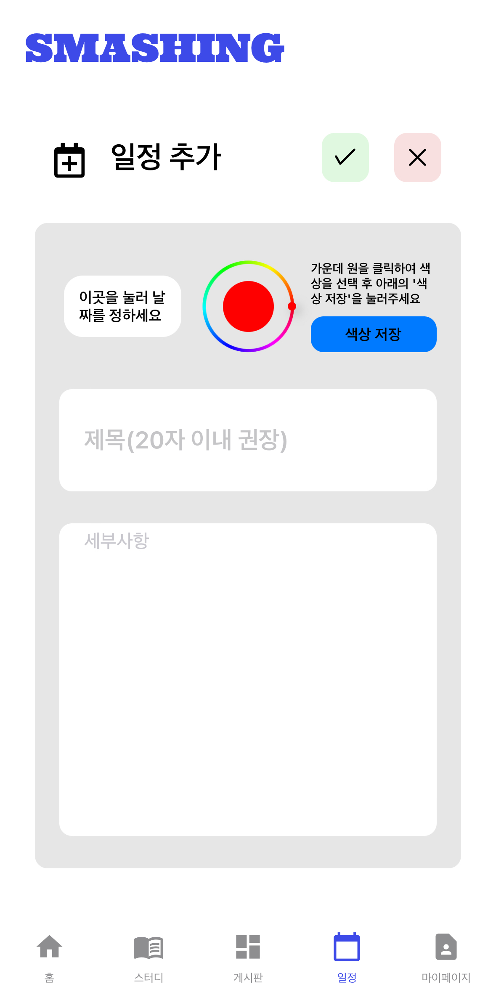
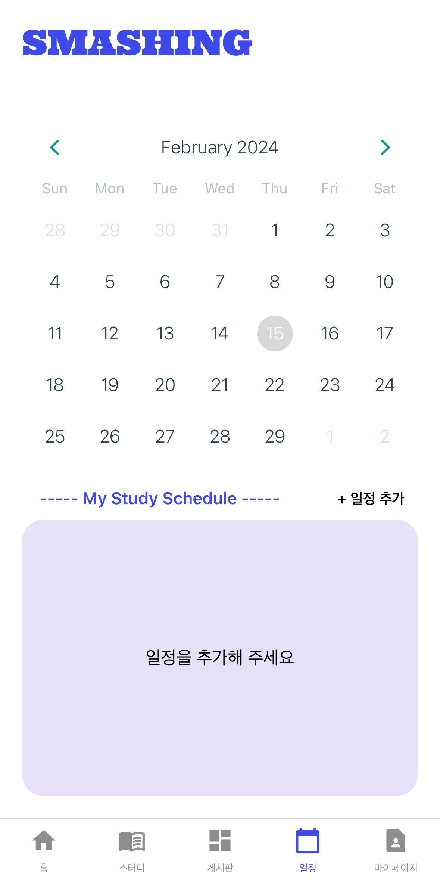
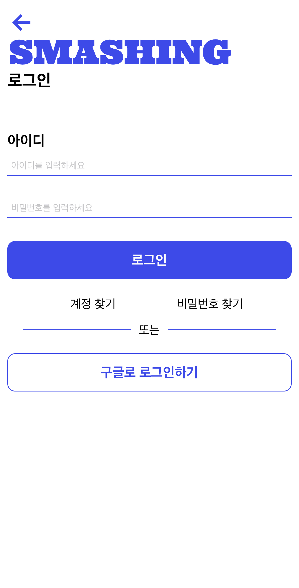
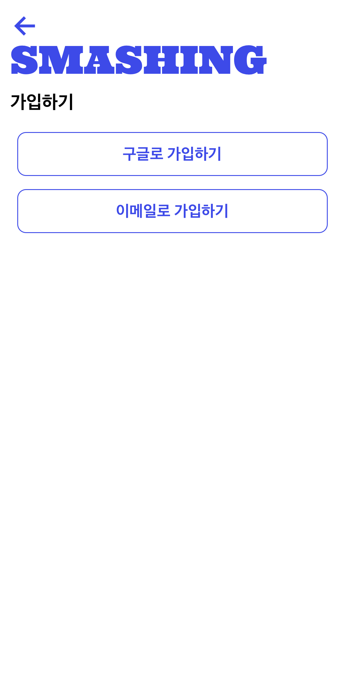

    

  

<h1 align="middle">SMASHING</h1>
<h3 align="middle">혼자서 하는 공부 다같이 힘을모아서 해보세요!!</h3>

 

- **프로젝트 개요:**  
우리 팀은 스터디를 더욱 효과적으로 구성하고 관리할 수 있는 스터디 매칭 어플리케이션을 개발하는 프로젝트를 진행하였다. 이 어플리케이션을 통해 학생들은 자신의 관심 분야에 맞는 스터디 그룹을 찾거나, 자신이 원하는 주제로 스터디 그룹을 만들어 다른 학생들과 협력하며 학습할 수 있다.

## 🙋‍♂️ Developer

| 이름 | [서지수]() | [서동섭](https://github.com/dongsubnambuk) | [김채원]() | [백수연]()| [한동균]() | [손경락]()|
| :-: | :-: | :-: | :-: | :-: | :-: | :-: |
| 기술 스택 ||  | |  |  |  |  |  |
| 분류 | 프론트엔드 | 프론트엔드 | 프론트엔드 | 프론트엔드 | 프론트엔드 | 프론트엔드 |

## ⭐ 주요 기능 ⭐ 
| **기능**                | **설명**                                                                                                                                                                                                 | **이미지**                              |
|-------------------------|--------------------------------------------------------------------------------------------------------------------------------------------------------------------------------------------------------|-----------------------------------------|
| **메인 페이지**          | 스터디 생성, 스터디 모임 찾기(온라인, 오프라인), 투두리스트 추가 및 삭제                                                                                                                                |     |
| **할일 추가**            | 투두리스트 추가 기능                                                                                                                                                                                    |  |
| **스터디 모임 만들기**   | 모임명, 인원수, 스터디 그룹 기간, 온/오프라인 스터디 유형 선택, 오프라인 스터디의 경우 지도에서 장소 검색 후 지정 가능, 스터디 섬네일 추가                                                                |  |
| **일정 생성**            | 캘린더를 이용하여 해당 날짜에 일정 추가                                                                                                                                                                |          |
| **일정 등록 페이지**     | 일정 등록 시 필요한 추가 정보 입력 가능                                                                                                                                                                |  |
| **로그인/회원가입**      | 자체 로그인 및 구글 로그인 기능 제공                                                                                                                                                                    |             |
| **회원가입**             | 회원가입 페이지                                                                                                                                                                                         |           |

 

## 🔧 Stack

**Frontend(APP)**
- **Language** : JavaScript
- **Library & Framework** : React Native,
- **Deploy**: expo
 

**Backend**
- **Firebase**
 

 
